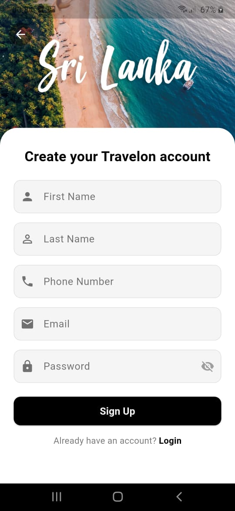

# Travelon

Travelon is a modern Flutter app for discovering, sharing, and booking travel experiences and events. It features seamless authentication, a beautiful moments feed, event booking, and robust integration with Firebase services.


---

## Features

- **Modern UI**: Glassmorphic app bar, soft gradients, and beautiful card layouts.
- **Authentication**: Secure sign up and login with Firebase Auth.
- **Moments Feed**: Share and explore travel moments with images, location, and user overlays.
- **Event Booking**: Book events, manage tickets, and track your bookings.
- **Profile Management**: Upload profile images and manage your traveller profile.
- **Phone Number & OTP**: Sri Lanka (+94) phone formatting, SMS subscription, and OTP verification.
- **Firestore Integration**: Robust Firestore rules, ticketing, and user booking tracking.

---

|                         Login                         |                         Signup                          |
| :---------------------------------------------------: | :-----------------------------------------------------: |
|  |  |

---

## Tech Stack

[](https://flutter.dev)
[](https://firebase.google.com)
[](https://cloud.google.com/firestore)
[](https://firebase.google.com/products/storage)

- **Flutter** (Dart)
- **Firebase Auth**
- **Cloud Firestore**
- **Firebase Storage**

---

## Getting Started

### Prerequisites

- Flutter SDK (stable channel) — follow the official install guide: https://flutter.dev/docs/get-started/install
- Android SDK (for Android builds) and/or Xcode (for iOS builds)
- Java JDK (for Android Gradle tooling)
- (Optional) Firebase CLI: https://firebase.google.com/docs/cli — useful for emulator and deploy workflows

> Tested on Flutter 3.x/4.x — run `flutter --version` to confirm your local setup.

### Local setup (quick)

1. Clone the repository and open it:

```powershell
git clone https://github.com/Team-EXYTE/Travelon-mobile.git
cd travelon_mobile
```

2. Install Dart/Flutter dependencies:

```powershell
flutter pub get
```

3. Create a `.env` file at the project root (the app loads environment values with `flutter_dotenv`).
   - The file is not included in source control. Add any API keys or configuration values your deployment needs, for example:

```text
# .env (example)
# Replace with your own values
FIREBASE_API_KEY=YOUR_FIREBASE_API_KEY
API_BASE_URL=https://your-api.example.com
```

4. Firebase configuration
   - Android: copy your `google-services.json` into `android/app/`.
   - iOS: copy `GoogleService-Info.plist` into `ios/Runner/` and add it to the Xcode project.
   - In the Firebase console enable the services the app uses (Authentication, Firestore, Storage).

5. Platform-specific notes
   - Android: Ensure an Android SDK and an emulator (or a device) are available. Configure `local.properties` with your SDK path if needed.
   - iOS: Open `ios/Runner.xcworkspace` in Xcode to configure signing (team, bundle id) before running on a device.

6. Run the app

```powershell
# list devices
flutter devices

# run on the default device
flutter run
```

### Common troubleshooting

- If you see build errors for Android Gradle or Kotlin, run `flutter doctor` and follow the fixes.
- If Firebase throws configuration errors, double-check `google-services.json`/`GoogleService-Info.plist` and the Firebase project settings.
- If the app can't find environment values, ensure the `.env` file exists and contains the required keys.

If you prefer, you can also open the project in Android Studio or VS Code and use the IDE tooling to run and debug the app.

---

## License

[MIT](LICENSE)

---

## Credits

- Built by Team-EXYTE.

## Contributors

- [Pathumi Ranasinghe](https://github.com/PathumiRanasinghe)
- [Sanuji Samarakoon](https://github.com/sanujis)
- [Induwara Rathnayake](https://github.com/InduwaraRathnayake)
- [Shanthisha Jayathunga](https://github.com/ShanthishaShyamana)
- [Chehan Dissanayake](https://github.com/nchehan)
